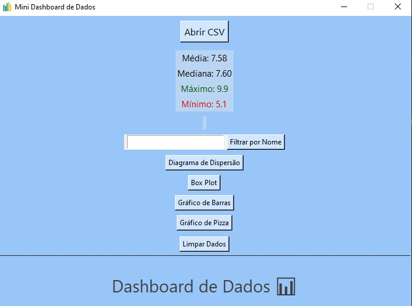
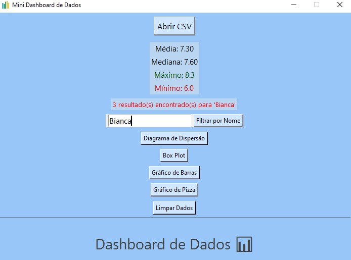

### 📊 Mini Dashboard de Dados com Python

Projeto desenvolvido com o objetivo de praticar e demonstrar habilidades com **Python**, **Tkinter**, **pandas** e **matplotlib**, criando uma aplicação que permite visualizar e analisar dados contidos em arquivos `.csv` de forma interativa e intuitiva.
Você pode utilizar qualquer arquivo `.csv` personalizado, desde que contenha as colunas `nome` e `nota`.  

Dessa forma, o dashboard pode ser usado para diferentes finalidades como:
- Análise de notas escolares
- Controle de despesas com nome + valor
- Avaliações por usuário
- E muito mais!

Sinta-se à vontade para adaptar o projeto aos seus próprios dados. 😉

---

## Objetivo do Projeto 🎯

Durante as férias, decidi unir prática e aprendizado em um projeto que representasse meu crescimento com Python.  
A ideia era criar algo útil, funcional e com uma interface amigável — e que fosse além do terminal.
Este dashboard é resultado de muito estudo, esforço e carinho. 💙

---

## Funcionalidades 💡

- 📂 Abrir arquivos `.csv` com dados
- 📈 Exibir estatísticas principais:
  - Média
  - Mediana
  - Máximo
  - Mínimo
- 🎯 Filtro por nome (com suporte a acentuação e letras maiúsculas/minúsculas)
- 📊 Geração de 4 tipos de gráficos:
  - Gráfico de Barras
  - Diagrama de Dispersão
  - Box Plot
  - Gráfico de Pizza
- 🎨 Interface Tkinter estilizada:
  - Fundo personalizado
  - Ícone na janela
  - Botões com hover

---

## Tecnologias utilizadas 📚

- **[Python 3.x](https://www.python.org/)** - Linguagem principal utilizada no desenvolvimento do projeto.

- **[Tkinter](https://docs.python.org/3/library/tkinter.html)** - Biblioteca padrão do Python para criação de interfaces gráficas (GUI).

- **[pandas](https://pandas.pydata.org/)** - Utilizada para leitura, manipulação e análise de dados estruturados (arquivos `.csv`).

- **[matplotlib](https://matplotlib.org/)** - Responsável por gerar os gráficos (dispersão, barras, pizza, boxplot) exibidos ao usuário.

- **[unidecode](https://pypi.org/project/Unidecode/)** - Usada para remover acentos e facilitar a filtragem de nomes, tornando a busca mais flexível.

- **[Pillow (PIL)](https://python-pillow.org/)** - Empregada para carregar e aplicar ícones personalizados na janela da aplicação.

- **[tkinter.filedialog e messagebox](https://docs.python.org/3/library/dialog.html)** - Módulos do Tkinter utilizados para abrir arquivos e exibir mensagens de alerta e erro.

---

## Desenvolvido por 💻

Jamile Rockenbach Ferreira, estudante de Ciência da Computação apaixonada por tecnologia, dados e por criar coisas que tenham impacto real! Este projeto foi um desafio pessoal para aplicar, aprender e mostrar o que sou capaz de desenvolver com Python.

---

## Interface 🧮

---